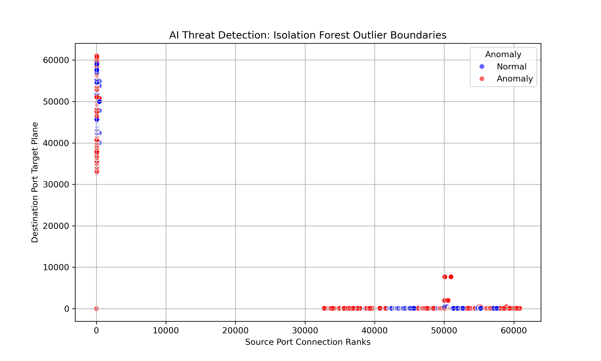

# 🛡️ AI-Based Network Threat Detection using Suricata & Wazuh

## 📌 Overview
This project implements a hybrid **AI-driven Network Intrusion Detection System (NIDS)** framework. The architecture utilizes **Suricata IDS** for raw packet capture and telemetry generation, an unsupervised **Machine Learning Isolation Forest model** for behavioral anomaly detection, and **Wazuh** for centralized security logging and visibility.

The system features an enterprise-grade multi-VM testbed capable of performing both batch log processing and real-time live streaming threat detection against network attacks.

---

## 🧠 Technologies Used
- **Suricata IDS** (High-Performance Packet Inspection & Telemetry)
- **Wazuh SIEM** (Centralized Security Log Management & Operations)
- **Python 3** (Real-Time Feature Engineering & Log Streaming)
- **Scikit-Learn** (Unsupervised Isolation Forest Framework)
- **Seaborn & Matplotlib** (Statistical Data Visualization)
- **VMware Cluster** (Ubuntu Linux 24.04, Kali Linux, and Windows 10)

---

## 🏗️ System Architecture & Data Flow
1. **Promiscuous Virtual Network:** Virtual machines (Windows 10, Kali Linux, and Ubuntu) are linked on a shared **VMware Bridged Adapter Matrix** with **Promiscuous Mode Enabled**, resolving traditional NAT isolation boundaries.
2. **Telemetry Collection:** Suricata sniffs the active interface (`ens33`/`eth0`) in real time, appending raw security events into `/var/log/suricata/eve.json`.
3. **Data Parsing & Tabulation:** Raw unstructured records are cleaned, extracting key parameters (`Source IP`, `Source Port`, `Destination Port`, `Signature`, `Severity`), and saved to a structured CSV format.
4. **Unsupervised Training Matrix:** Categorical text fields are digitized via `LabelEncoder`. An **Isolation Forest algorithm** evaluates a massive baseline of **84,191 raw connection records** to establish standard network normalcy.
5. **Real-Time Guard Engine:** The live defender script continuously tails the active `eve.json` file stream, maps new variables onto the pre-trained trees, suppresses administrative update loops (`apt`), and flags true anomalies.
6. **Dual-Engine SOC Monitoring:** Wazuh ingests the live Suricata stream to populate the security dashboard, while the independent Python AI engine runs concurrently on the host console tracking behavioral outliers.

---

## 📄 File Description

### 🔹 Python Control Modules
* **parse_suricata.py**  
  Ingests raw JSON blocks from `/var/log/suricata/eve.json` and structures **19,957 target alert fields** into a clean feature table.
* **ai_detector.py**  
  Processes data tables, trains the unsupervised Isolation Forest engine, and exports the structural binary files (`.pkl`).
* **ai_live_defender.py**  
  The streaming defense script. Automatically tails live traffic logs, performs real-time categorization, and isolates incoming malicious payloads from external nodes.
* **generate_charts.py**  
  Processes network metrics to plot mathematical decision boundaries.

### 🔹 Datasets & Output Files
* **suricata_alerts_dataset.csv**  
  The primary tabular dataset extracted by the parser script containing historical network metadata records.
* **isolated_anomalies.csv**  
  A historical triage log containing the high-severity threat events flagged during the batch training cycle.
* **ai_anomalies.json**  
  The real-time, live data file generated in `/var/log/suricata/` that bridges the Python script's predictions directly into the Wazuh collector framework.
  
## 🔹 Models & Encoders

- **isolation_forest_model.pkl**  
  Pre-trained Isolation Forest model used for anomaly detection in network traffic.
- **le_source.pkl**  
  Label encoder that converts source-related categorical values into numeric form.
- **le_signature.pkl**  
  Label encoder that converts Suricata alert signatures into numeric values for ML processing.
  
### 🔹 Machine Learning Anomaly Map
* **ai_detection_boundary.png**  
  A scatter plot showing how the Isolation Forest partitions normal events from structural threats:
  * **Normal Blue Clusters:** Dense, repetitive connection clusters (such as system updates) requiring deep tree splits to resolve.
  * **Anomalous Red Points:** Statistical outliers (such as hostile SQL Injections, port scans, and executable file downloads over high ephemeral destination ports) isolated quickly at shallow tree depths.

<p align="center">
  
</p>

## ⚙️ Deployment & Operational Workflow

### 1️⃣ Install Core Dependencies & System Tools
Install essential utilities, the Apache web target, and statistical graphics libraries on your Ubuntu machine:
```bash
sudo apt update && sudo apt install suricata apache2 -y
sudo apt install python3-seaborn python3-matplotlib python3-pandas -y
```

### 2️⃣ Initialize Promiscuous Sniffing
Enable the network interface card to read traffic originating from the Windows and Kali VMs:
```bash
sudo ip link set ens33 promisc on
```

### 3️⃣ Execute the Core Data Pipeline
Run the modular components sequentially to build, train, and deploy your framework:
```bash
# Step A: Generate tabular tracking sheets from raw logs
sudo python3 parse_suricata.py

# Step B: Execute model training and export binary pickles
python3 ai_detector.py

# Step C: Launch the live real-time analytical threat defender
sudo python3 ai_live_defender.py
```

### 4️⃣ Launch Validation Attacks (From Kali Linux or Windows Guest VMs)
Execute explicit attack strings against the Ubuntu target (`192.168.0.104`) to watch the system catch anomalies live:
```bash
# Vector 1: Web Exploitation (SQL Injection String)
curl -A "Mozilla/5.0" "http://192.168.0"

# Vector 2: Host Infrastructure Reconnaissance (Web Vulnerability Scan)
nikto -h 192.168.0.104

# Vector 3: High-Frequency Connection Volumetric Loop
for /L %i in (1,1,50) do curl http://testmyids.com
```

---

## 🛡️ Dual-Engine SOC Orchestration (Wazuh & AI)
The framework implements a highly resilient, parallel dual-defense setup to minimize detection latency:
- **SIEM Dashboard Layer (Wazuh - Rule ID 86601):** Wazuh captures and visualizes raw Suricata alerts natively. This guarantees high-speed logging of known signature-based attacks on the main web interface.
- **Endpoint Analytics Layer (Isolation Forest AI Console):** The Python defender acts as an independent behavioral brain. It evaluates statistical feature rarity (such as traffic spikes or rare high ports) rather than static rules, successfully discovering zero-day anomalies and suspicious informational behaviors (like hidden executable downloads) directly on the terminal console.

---

## 🚀 Key Features

*   **Hybrid Multi-Engine Threat Architecture**  
*   **Zero-Day and Evasive Vector Detection**  
*   **Unsupervised Anomaly Modeling**  
*   **Algorithmic Local Noise Suppression**  
*   **Enterprise SIEM Co-Orchestration**  
*   **High-Fidelity Virtual Testbed Infrastructure**  
---

## 🔮 Future Enhancements

*   **Transition to Deep Learning Sequential Models**  
*   **Automated Active-Response Firewalls (IPS Conversion)**  
*   **Advanced Multi-Class Threat Classification**  
*   **Self-Healing Autonomous Model Retraining**  
*   **Integrated Web-Based Analytics UI (Flask & Grafana)**  
  
## 👩‍💻 Author
**Ayesha Gillani**  
Cybersecurity | Network Security | AI-Driven IDS
